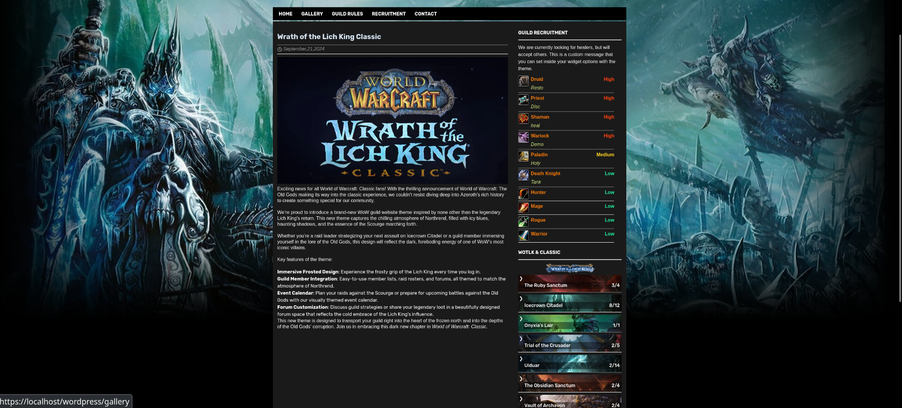
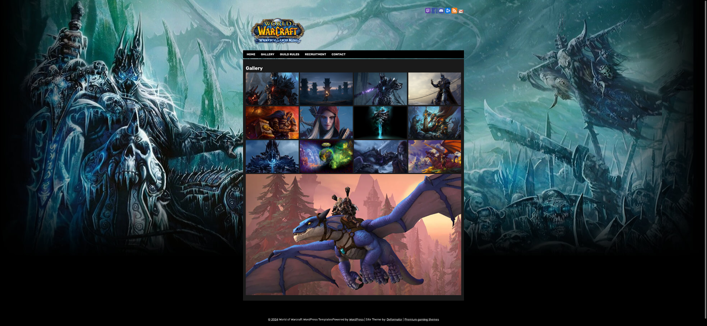

#  This is a site for a guild in world of warcraft wrath of the lich king

#  Design and idea for this site I get from this wordpress theme:https://www.ejeet.net/product/wrath-of-the-lich-king-classic-theme/
This site is stretched on wordpress, the plugins that are used in this project are advanced custom fields.
In this topic you can write posts that will be displayed on the main page. Also in the sidebar you can add/remove/change classes and the number of passed bosses in raids.You can modify any guild rules on the guild rules page
This site also has the ability to send letters if you want to join the guild and send letters if you need to contact the administration of the guild.
The site has a responsive design of such screen resolutions:768px-900px and 900px-1200px.

#  The standard look of a website for computers:
## Homepage

## Single Post

## Gallery

